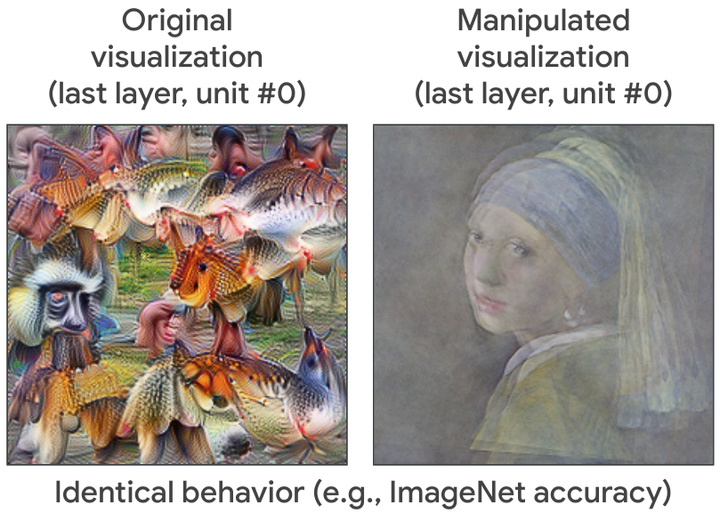

# Code for "Don't trust your eyes: on the (un)reliability of feature visualizations"

This repository contains code to replicate experiments from [Don't trust your eyes: on the (un)reliability of feature visualizations](https://arxiv.org/abs/2306.04719) by Robert Geirhos*, Roland S. Zimmermann*, Blair Bilodeau*, Wieland Brendel, and Been Kim.

## Fooling feature visualizations
Feature visualizations are widely used interpretability tools - but can we trust them? We investigate this question from an adversarial, empirical and theoretical perspective. The result: Don’t trust your eyes!



For instance, from an adversarial perspective we can adapt a model such that it maintains identical behavior on natural image input (e.g., identical ImageNet accuracy) but its feature visualizations are changed completely. In the example here, the feature visualization shows a painting (right) instead of the original feature visualization (left).

## Citation
```
@article{geirhos2023fooling,
  url = {https://arxiv.org/abs/2306.04719},
  author = {Geirhos, Robert and Zimmermann, Roland S and Bilodeau, Blair and Brendel, Wieland and Kim, Been},
  title = {Don't trust your eyes: on the (un)reliability of feature visualizations},
  journal={arXiv preprint arXiv:2306.04719},
  year = {2023},
```

## Disclaimer
This is not an officially supported Google product.


